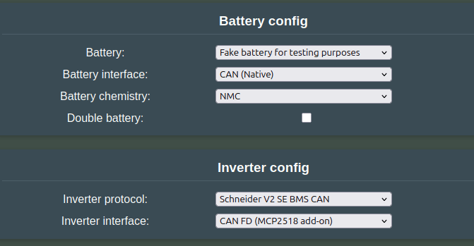

## Why add another CAN channel?

Some Inverters do not like to see automotive CAN frames on the CAN channel meant for stationary storage. When they see these messages, they enter a fault state. To get around this, we can add an external CAN interface to the Battery-Emulator hardware, to get an isolated secondary CAN bus.

You may want to set up a [double](../software/battery_2x.md) or a [triple](../software/battery_3x.md) battery system, then each pack must have its own CAN interface.

## Why CAN-FD?

Some batteries use CAN-FD instead of just CAN. Batteries like Kia EV6 are moving towards the faster and more flexible CAN-FD. Most boards, for instance the LilyGo T-CAN485 and T-2CAN, are not compatible with the CAN-FD protocol, but this can be added with an extra MCP2518FD chip via the GPIO pins, similar to the CAN add-on setup.

## Hardware

The hardware used is an inexpensive chip, "MCP2518FD Pro", which can be purchased [HERE](https://www.aliexpress.com/item/1005006433378885.html)

!!! note "NOTE"
    While the code technically works with MCP2517FD chips, these chips apparently have a hardware bug and should be avoided. Please source **MCP2518FD** chips instead to ensure proper CAN-FD operation.

### Connecting it to LilyGo T-2CAN

See the [T-2CAN expansion header](../../hardware/lilygo_t_2can.md#expansion-header)

### Connecting it to LilyGo T-CAN485

    MCP2518FD -> Lilygo
    ___________________
    SCK  -> IO 12
    MOSI -> IO 5
    MISO -> IO 34
    CS   -> IO 18
    INT  -> IO 35
    GND (next to 3V3) -> Any GND pin on LilyGo
    3V3  -> VDD on LilyGo
    GND (next to 5V) -> Any GND pin on LilyGo (+ to GND on external 5V source)
    5V   -> 5V source, can be same as feeds LilyGo via the input pins.

### Alternative 5V source

The Lilygo also has a 3V3 to 5V boost switch-mode power supply (it is used for the RS485 chip on the Lilygo). It does not have an overly convenient location for connecting, but it can be soldered to one side of C62 (side closest to C64). The Lilygo can then be powered with 12V, which can be more convenient than powering the Lilygo with 5V. See the red wire in the image below. Of course the 5V supply on the Lilygo must be enabled for this to work.

### Alternative hardware

[Another board](https://www.aliexpress.com/item/1005007349452566.html) built around the same "MCP2518FD Pro" chip has been shown to work once the oscillator is configured to `OSC_20MHz` - see details below

The labelling on this board is slightly different:

    MCP2518FD -> Lilygo
    ___________________
    SCK -> IO 12
    SDI -> IO 5
    SDO -> IO 34
    nCS -> IO 18
    INT -> IO 35
    GND (next to 3V3) -> Any GND pin on LilyGo
    3V3 -> VDD on LilyGo
    GND (next to 5V) -> Any GND pin on LilyGo (+ to GND on external 5V source)
    5V -> 5V source, can be same as feeds LilyGo via the input pins.

!!! note "NOTE"
    Only one GND connector is technically required if the same ground is being used for the board.

## Software setup

Then configure the component you want to use CANFD on, by selecting "CAN FD (MCP2518 add-on)" on the component that you intend to connect to the chip.

## Testing operation

If you are unsure if the newly added add-on chip works, you can perform the following loopback test. Connect CAN-H and CAN-L to the native CAN channel with two wires, and set up the code to transmit messages via for instance the Schneider V2 protocol. Remember to enable Use CanFD as classic CAN , and also to configure the interfaces as shown below. Once it is all set up, use the [CAN logging page](can_logging.md) to verify that you get incoming RX messages that match the TX.

Test settings, for looping back CAN with Schneider CAN to battery CAN.

Example where wires not connected: (Only TX, no RX messages)

Example where wires connected (Everything works, TX and RX incoming on native)

## Logging CAN-FD messages

It is possible to log CAN messages via USB serial or Webserver, see the [CAN logging page](can_logging.md) for more info.

## See Also

- [CAN add‐on MCP2515](can_add_on_mcp2515.md) (deprecated)
